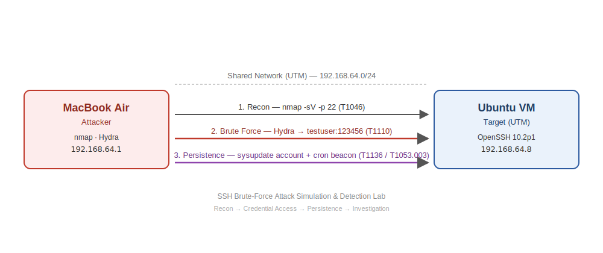

# SSH Brute-Force Attack Simulation & Detection Lab

A hands-on lab simulating an SSH brute-force attack against a Linux target, followed by basic
persistence and a full SOC-style investigation of the intrusion using log analysis.

## Network Diagram



## Scenario

**Attacker:** macOS host (nmap, hydra via Homebrew)
**Target:** Ubuntu VM (UTM), shared network
**Attack path:** recon → SSH brute-force → persistence → detection & investigation

| Phase | Technique | ATT&CK ID |
|---|---|---|
| Reconnaissance | Service enumeration (nmap) | T1046 |
| Credential Access | Brute Force — SSH | T1110 |
| Persistence | Create Account | T1136 |
| Persistence | Cron Job | T1053.003 |

## Stack

| Tool | Purpose |
|---|---|
| nmap | Target reconnaissance / service enumeration |
| Hydra | SSH brute-force attack |
| Python 3 | Custom log analysis / detection script |
| auth.log | Primary evidence source |

## Repository Structure

```
ssh-bruteforce-lab/
├── recon/
│   └── nmap-scan.md            # Target enumeration
├── attack/
│   └── hydra-attack.md         # Brute-force attack details
├── persistence/
│   └── backdoor-notes.md       # Post-exploitation persistence
├── investigation/
│   ├── auth-log-analysis.md    # Manual timeline reconstruction
│   ├── detect_bruteforce.py    # Automated detection script (WIP)
│   └── sample-ssh-auth.log     # Real captured log lines used to test the script
├── assets/
│   └── network-diagram.svg     # Attacker/target network diagram
└── report/
    └── incident-report.md      # Full incident report
```

## How to Run

Setup and attack steps are documented in [`recon/nmap-scan.md`](recon/nmap-scan.md) and
[`attack/hydra-attack.md`](attack/hydra-attack.md). A full reference of every command
used across all phases, with descriptions, is in [`COMMANDS.md`](COMMANDS.md).

## Report

See [`report/incident-report.md`](report/incident-report.md) for the full incident report,
including timeline, IOCs, MITRE ATT&CK mapping, and remediation recommendations.

## Author

**Ignacio Solano** — Aspiring SOC Analyst
[GitHub](https://github.com/IgnacioSol)
